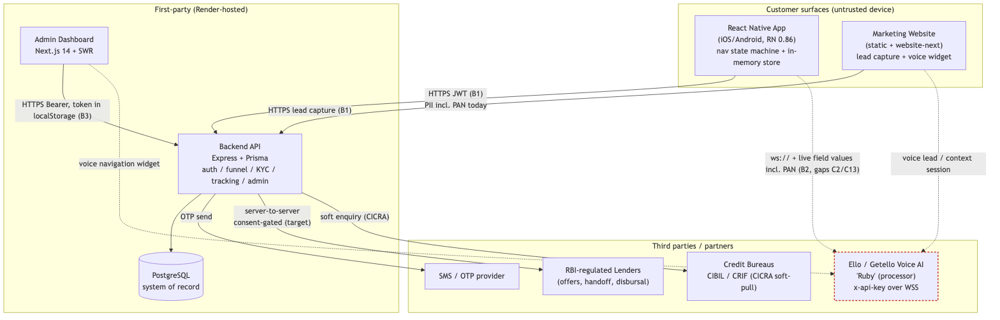
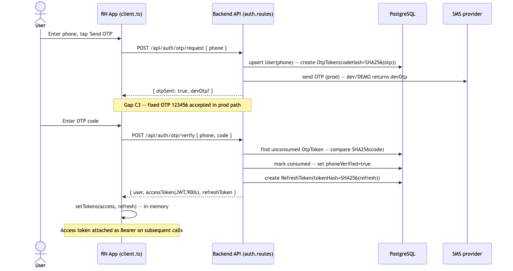
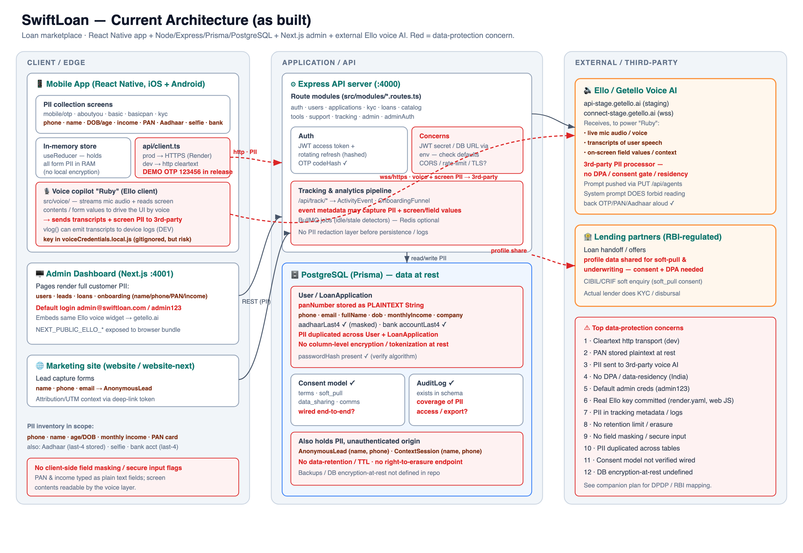
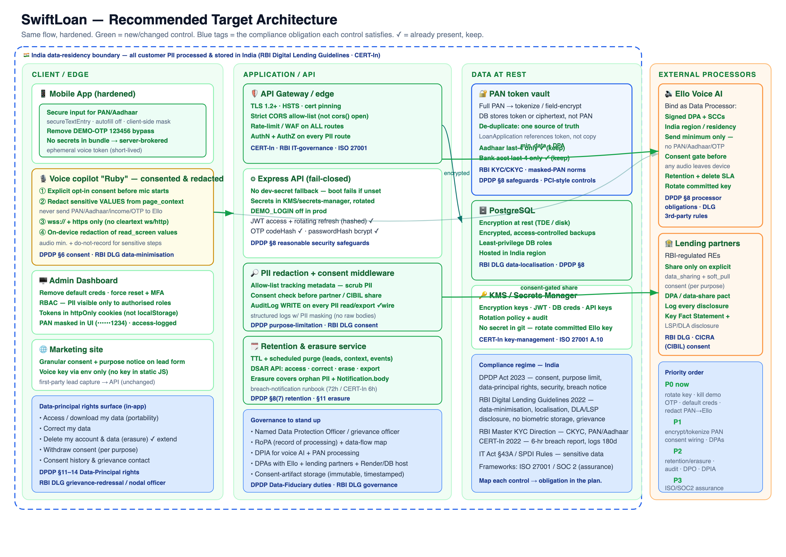

# SwiftLoan — Technical Architecture Document (TAD)

> **Document ownership & accountable roles** — Product Owner: **Sridhar Muppidi** · Product Head: **Sachin Tulla** · Technical Head: **Sachin Tulla** · Head of Engineering: **Hari PS** · Security Head: **Anil M**.

> **Classification: CONFIDENTIAL** — Internal / auditor distribution only. Do not
> circulate outside the ISMS scope or the engaged assessment body.

---

## 1. Document control

| Field | Value |
|---|---|
| Document title | SwiftLoan Platform — Technical Architecture Document (TAD) |
| Document ID | SL-COMP-TAD-002 |
| Version | 1.0 |
| Date | 2026-08-04 |
| Status | Draft for audit review |
| Owner | Head of Engineering / Platform Architecture |
| Approver | CTO; Information Security Officer (ISMS owner) |
| Classification | Confidential |
| Applicable ISMS | ISO/IEC 27001:2022 (primary); ISO/IEC 27701, 27017/27018 (supporting) |
| Assurance target | **SOC 2 (AICPA Trust Services Criteria)** — Security (CC1–CC9), Availability (A1), Confidentiality (C1), Processing Integrity (PI1), Privacy (P) |
| Source of truth | `docs/compliance/_AUDIT_BRIEF.md` (Verified Fact Base) |

### 1.1 Revision history

| Version | Date | Author | Change summary |
|---|---|---|---|
| 0.1 | 2026-07-28 | Platform Architecture | Initial skeleton, component inventory |
| 0.9 | 2026-08-01 | Platform Architecture | Data + security architecture drafted against verified fact base |
| 1.0 | 2026-08-04 | Platform Architecture | Current-vs-target gap table (C1–C14), ISO 27001 traceability, diagrams; issued for audit review |

### 1.2 Distribution

ISMS owner, CTO, Engineering leads, external ISO/IEC 27001 lead assessor, Data Protection Officer (to be appointed — see gap C10/governance).

---

## 2. Introduction

### 2.1 Purpose

This Technical Architecture Document (TAD) is the authoritative description of how
the SwiftLoan platform is built, deployed, secured, and operated. It exists to give
an ISO/IEC 27001:2022 assessor a single, verifiable view of the technology estate,
its data flows, its trust boundaries, and the delta between the **current state**
(as it exists in the repository today) and the **target state** required to pass an
information-security audit and to meet the applicable Indian regulatory regime.

This document deliberately records **known architectural gaps** as first-class
content (Section 8 and Section 11). These gaps are traced to the verified concern
register (C1–C14) and to the Annex A controls they violate. Nothing in this document
overstates the current control posture.

### 2.2 Scope

This document supports two concurrent assurance targets that share the same
underlying architecture and evidence: **ISO/IEC 27001:2022** (the primary
certification, an ISMS/Annex A control audit) and **SOC 2** against the AICPA Trust
Services Criteria (an assurance report over Security plus the elected categories
Availability, Confidentiality, Processing Integrity, and Privacy). The ISO Annex A
tags and the SOC 2 TSC references in Sections 8 and 12 are complementary views of
the same controls. **SOC 2 Type II** additionally requires **evidence of operating
effectiveness over a defined review period** (typically 3–12 months) — not merely
that a control is designed, but that it operated continuously — so several
target-state controls in Section 11 must be in place *and generating evidence*
before a Type II window opens.

**In scope:** the five deployable/first-party components — the React Native mobile
app, the Express/Prisma/PostgreSQL backend API, the Next.js admin dashboard, the
marketing website, and the integration boundary with the external Ello/Getello
voice AI ("Ruby"). Includes the data model, authentication model, transport
security, hosting on Render, and the data flows across all trust boundaries.

**Out of scope (referenced, not owned):** internals of the third-party Ello voice
platform, internals of RBI-regulated lending partners and credit bureaus, and the
underlying cloud provider's physical/host controls (inherited under ISO 27017/27018
and treated as supplier controls under A.5.19–A.5.23).

### 2.3 Audience

ISO/IEC 27001 lead assessor and audit team; Information Security Officer; DPO
(to be appointed); Engineering and DevOps; senior management accountable for the
ISMS. A working knowledge of web/mobile architecture and TLS/JWT concepts is
assumed.

### 2.4 Regulatory posture (context for the architecture)

SwiftLoan is a **Lending Service Provider (LSP)** operating a **Digital Lending App
(DLA)** on behalf of RBI-regulated lenders. It does **not** lend directly and does
**not** decide approvals. This shapes the architecture: the platform is an
**origination, recommendation, and handoff** system, not a core lending ledger. The
regulatory obligations that most directly constrain the architecture are RBI Digital
Lending Guidelines 2022 (data minimisation, localisation, no biometric storage,
direct-disbursal, grievance redressal), the DPDP Act 2023 (consent, purpose
limitation, data-principal rights), and CERT-In 2022 (6-hour breach reporting,
180-day log retention, NTP sync).

### 2.5 References

- `_AUDIT_BRIEF.md` — Verified Fact Base (governing source).
- `CLAUDE.md` — engineering architecture notes (navigation state machine, tracking layer, admin dashboard).
- `server/prisma/schema.prisma` — canonical data model.
- `render.yaml` — deployment blueprint.
- `ios/SwiftLoan/Info.plist` — iOS App Transport Security posture.
- Companion documents: 01-PRD, 03-Security-&-Compliance, 04-Test-Cases.

### 2.6 Definitions and abbreviations

| Term | Meaning |
|---|---|
| LSP / DLA | Lending Service Provider / Digital Lending App (RBI 2022) |
| PII / SPDI | Personal Information / Sensitive Personal Data or Information (IT Act §43A + SPDI Rules 2011) |
| PAN | Permanent Account Number (Indian tax ID) — SPDI-class financial identifier |
| KYC / CKYC | Know Your Customer / Central KYC |
| OTP | One-Time Passcode (SMS-based login factor) |
| JWT | JSON Web Token (stateless access token) |
| RBAC | Role-Based Access Control |
| KMS | Key Management Service |
| DSAR | Data Subject Access Request (DPDP data-principal rights) |
| DPA | Data Processing Agreement |
| ATS | App Transport Security (iOS TLS enforcement) |
| Ruby / Ello | The external Getello voice AI assistant ("Ruby") and its platform |
| RoPA / DPIA | Records of Processing Activities / Data Protection Impact Assessment |

---

## 3. Architecture overview

### 3.1 System context

SwiftLoan is a distributed, multi-tier system composed of **five first-party
components** and three classes of **external processors/partners**. The customer
interacts primarily through the React Native mobile app; a marketing website and an
optional voice assistant act as top-of-funnel entry points; an internal Next.js
admin dashboard is used by operations staff. All state of record lives in a single
PostgreSQL database behind the Express API.

The five components:

1. **React Native mobile app** (iOS + Android, RN 0.86, React 19, TypeScript). The
   primary customer surface. Runs the entire onboarding + loan funnel. Uses a
   hand-rolled navigation state machine and an in-memory store (no router library,
   no Redux). Talks to the backend through a single typed API client
   (`src/api/client.ts`) and, optionally, to the external Ello voice service.

2. **Backend API** (Node/Express + Prisma + PostgreSQL). The system of record and
   the only component that touches the database. Layered as
   `modules/*.routes.ts → lib/prisma.ts`. Owns authentication (JWT access +
   rotating hashed refresh + hashed OTP), the loan funnel, KYC records, tracking
   ingestion, and the admin API.

3. **Admin dashboard** (Next.js 14 + SWR + Recharts). Internal operations console
   for users, leads, loans, onboarding funnels, downloads, analytics, and
   notifications. Talks only to the backend API. Has its own real admin auth
   (bcrypt + JWT + rotating refresh) and an optional Ello voice-navigation widget.

4. **Marketing website** (static `website/` + `website-next/`). Lead capture and app
   promotion. Hosts a browser voice widget that can create leads / context sessions
   for the deferred-deep-link install handoff.

5. **External Ello/Getello voice AI ("Ruby")** — a **third-party processor**. Not
   owned by SwiftLoan. Provides the conversational assistant used in the mobile app
   and admin dashboard. Receives session context and audio over its own API/WSS
   endpoints authenticated with an `x-api-key`.

**External partners (data recipients / sources):** RBI-regulated **lending partners**
(offer/handoff, soft-pull), **credit bureaus** (CIBIL/CRIF under CICRA 2005 soft
enquiry), and **SMS/notification** providers.

### 3.2 Trust boundaries

- **B1 — Device ↔ Backend:** public internet; TLS required. iOS enforces ATS; Android
  release disallows cleartext. This boundary carries PII including full PAN today.
- **B2 — Device/Website ↔ Ello:** public internet to a **third-party** processor.
  Currently defaults to cleartext `ws://`/`http://` in the mobile voice config (gap
  C13), and live on-screen field values (incl. PAN) can egress via `read_screen` /
  `page_context` (gap C2).
- **B3 — Admin browser ↔ Backend:** public internet; TLS. Admin tokens are held in
  `localStorage` (gap C11).
- **B4 — Backend ↔ PostgreSQL:** managed database connection. No app-level
  encryption-at-rest / tokenisation of PAN today (gaps C1, C12).
- **B5 — Backend ↔ Lenders / Bureaus:** server-to-server; consent-gated in target
  state (currently `Consent` model exists but is not enforced end-to-end).

### 3.3 Component / data-flow diagram (system context)

*Figure rendered to a real image; editable source: `docs/compliance/diagrams/tad-fig1-system-context.mmd`.*

---

## 4. Technology stack

| Component | Language / runtime | Framework | Key libraries | Infra / hosting | Datastore |
|---|---|---|---|---|---|
| Mobile app | TypeScript, React 19 | React Native 0.86 (bare CLI, **no Expo**) | Hand-rolled nav (Context + `useReducer`), `react-native-linear-gradient`, `react-native-svg`, `react-native-safe-area-context`; Material Symbols + Inter fonts | iOS App Store / Google Play (device) | In-memory store; session token in api-client module |
| Backend API | TypeScript / Node.js | Express | Prisma v6 (pinned), `zod` (validation), `helmet`, `cors`, `morgan`, `express-rate-limit`, `bcryptjs`, `jsonwebtoken`, BullMQ (Redis-optional jobs) | Render web service (`server/`, `:4000`) | **PostgreSQL** (via `DATABASE_URL`, e.g. Neon) |
| Admin dashboard | TypeScript / Node.js | Next.js 14 | SWR (data fetching), Recharts (charts), Ello agent client | Render web service (`admin/`, `:4001`) | None (reads via API) |
| Marketing website | HTML/CSS/JS (+ Next variant) | Static site / Next.js | `voice-widget.js` (Ello browser client) | Render static site (`website/`) | None (posts leads to API) |
| Voice AI ("Ruby") | External (Getello) | Getello assistant / Gemini Live | Ello session API + WSS transport, `x-api-key` auth | **Third-party** (`*.getello.ai`) | Owned by Ello (out of scope) |

Cross-cutting conventions: all new API responses use the
`{ success, data, message, pagination?, error? }` envelope; all monetary amounts are
stored and transported in **paise**; tracking calls are fire-and-forget.

---

## 5. Application architecture

### 5.1 Mobile app

The mobile app is **not** built on a conventional router/state library. Three
purpose-built pieces make up its architecture:

- **Navigation state machine** — `src/state/store.ts` is a React Context +
  `useReducer` holding *all* app state (current `screen`, every form field, auth/OTP
  state, profile, notification prefs). It exposes `go(screen)`, `back()`, `set()`,
  `showToast()`, `reset()`. The back-stack is a static `PREV` map
  (`store.ts:33`), and two timed auto-transitions (`splash→language`,
  `finding→offers`, both 2.6 s) run in an effect. `src/Router.tsx` renders
  `SCREENS[state.screen]`. The canonical screen list is `SCREEN_NAMES`
  (`store.ts:21`); several routes (`apply/income/residence/consent/prequalify`) are
  intentionally logic-only dead routes.

- **In-memory store** — there is no persistent client store; app state lives in
  memory for the session. The API session token is held in the api-client module
  (`src/api/client.ts`) and mirrored (`authUser`/`applicationId`/`loanId`) in the
  store. **Security note:** because there is no encrypted client-side persistence,
  there is also no client-side secure input / field masking for PAN/Aadhaar today
  (gap C14).

- **API client** — `src/api/client.ts` is the single typed gateway to the backend.
  Base URL auto-selects `localhost` (iOS) / `10.0.2.2` (Android). It attaches the
  JWT as a Bearer header, applies a 4 s request timeout (`REQUEST_TIMEOUT_MS`,
  `client.ts:30`), and degrades gracefully to demo data when offline. **The demo
  path accepts a fixed OTP `123456` (`DEMO_OTP`, `client.ts:77`) with `DEMO_ALLOWED
  = true` including release builds (`client.ts:84`) — gap C3.**

The **voice layer** (`src/voice/`) is a self-contained client for the external Ello
assistant: `config.ts` (endpoints/keys), `actionRegistry.ts` + `screenGraph.ts`
(what the assistant can see/do per screen), `tools.ts` (`read_screen`,
`perform_ui_action`), and `sensitive.ts` (the `sensitive` flag). The `sensitive`
flag blocks the assistant from *writing* a field but **does not redact its current
value from reads** — `read_screen`/`page_context` still emit `current_value`
(`tools.ts:260`, `actionRegistry.ts:204`) — gap C2.

### 5.2 Backend API

Layered and module-oriented. Each domain is an Express router in
`server/src/modules/*.routes.ts` (`auth`, `users`, `applications`, `kyc`, `loans`,
`catalog`, `tools`, `support`, plus WS4 `tracking`, `admin`, `adminAuth`, and WS3
`context`, `downloads`). Routers validate input with `zod` middleware and reach the
database only through `lib/prisma.ts`. Global middleware in `app.ts`: `helmet()`,
`cors()` (fully open — gap C7), `express.json({ limit: '1mb' })`, and `morgan` in
non-prod. A single `authLimiter` (30 req/60 s) is applied to `/api/auth` and
`/api/admin/auth` **only** — no per-route rate limiting elsewhere (gap C7). A health
check is exposed at `/api/health`.

The funnel data path: application funnel → `LoanApplication` → `Offer` → `Loan` +
`Repayment[]`. KYC verifications are recorded in `KycVerification` (the app's KYC
screens are currently non-functional demo stubs).

### 5.3 Admin dashboard

Next.js 14 App Router with SWR for data fetching and Recharts for visualisation.
It talks only to the backend API at `NEXT_PUBLIC_API_BASE`. Pages: Master Overview,
Onboarding (list + single journey), Loan Pipeline (+ single), Leads & Contact Us
(+ single lead journey), App Downloads, All Users, User Profile, Analytics,
Notifications. A token-guarded Shell wraps authenticated pages. **Admin access +
refresh tokens are stored in browser `localStorage`** (`admin/src/lib/api.ts:10-27`)
and attached as Bearer headers — XSS-exfiltratable (gap C11). An optional Ello
voice-navigation widget (`admin/src/lib/ello-agent.ts`, `ello-tools-admin.ts`) is
env-gated.

### 5.4 Authentication model

| Aspect | Implementation | Reference |
|---|---|---|
| Primary login | Phone + SMS OTP | `auth.routes.ts` `/otp/request`, `/otp/verify` |
| Access token | Stateless JWT, TTL 900 s (`ACCESS_TTL`) | `signAccess`, `render.yaml:29` |
| Refresh token | Opaque random 32-byte token; **only the SHA-256 hash is stored** (`RefreshToken.tokenHash`, unique); rotated; revocable on logout | `auth.routes.ts:14-18,102-123`; `schema.prisma:107` |
| OTP storage | **SHA-256 hashed** (`OtpToken.codeHash`), 5-min expiry, single-use (`consumed`) | `crypto.ts:6`; `schema.prisma:94` |
| Password storage | **bcrypt** (cost 10) for `User.passwordHash` and `AdminUser.passwordHash` | `crypto.ts:4`; `schema.prisma:51,462` |
| Admin auth | Real: bcrypt + JWT + rotating hashed `AdminRefreshToken` | `adminAuth.routes.ts`; `schema.prisma:471-481` |
| Anonymous session | "Skip" issues an anonymous/degraded session | `client.ts` `ensureSession` |

**Controls already in place (do not "fix"):** hashed OTP and refresh tokens, bcrypt
passwords, rotation + revocation of refresh tokens. **Gaps:** fixed-OTP demo bypass
in production (C3), default super-admin credentials seeded and displayed on the
login page (C4), fail-open JWT/admin secrets (C6), no MFA on admin, admin token in
`localStorage` (C11).

---

## 6. Data architecture

### 6.1 Prisma data model (system of record)

The canonical model is `server/prisma/schema.prisma`: Postgres provider, UUID PKs,
enums, indexes, and `createdAt/updatedAt` audit timestamps throughout. Principal
entities:

- **Identity & auth:** `User` (phone-unique root record), `OtpToken`,
  `RefreshToken`, `Consent` (types: `terms`, `soft_pull`, `data_sharing`,
  `communications`).
- **Funnel:** `LoanApplication` → `Offer` (← `LenderPartner`) → `Loan` →
  `Repayment[]`; `KycVerification`.
- **Support/governance:** `SupportTicket` (query/grievance), `AuditLog` (**exists but
  is not yet written to** — gap C10).
- **WS4 tracking + admin (additive):** `Session`, `ActivityEvent`,
  `OnboardingFunnel`, `AnonymousLead`, `AppDownload`, `AdminUser`,
  `AdminRefreshToken`, `Notification`.
- **WS3 handoff:** `ContextSession` (opaque-token deep-link context carry).

### 6.2 PII data model and classification

| Data element | Model field | Class (IT Act SPDI / DPDP) | State today | Ref |
|---|---|---|---|---|
| Phone number | `User.phone` (unique) | PII | plaintext | schema:49 |
| Name (first/last/full) | `User.firstName/lastName/fullName` | PII | plaintext | schema:52-54 |
| DOB / age | `User.dob` | PII | plaintext (full DOB) | schema:55 |
| Monthly income | `User.monthlyIncome`, `LoanApplication.monthlyIncome` | **SPDI (financial)** | plaintext | schema:60,169 |
| **PAN card** | `User.panNumber` **and** `LoanApplication.panNumber` | **SPDI (financial)** | **FULL PAN, PLAINTEXT, duplicated** ⚠ | schema:62,171 |
| Aadhaar | `User.aadhaarLast4` | SPDI | **last-4 only** ✓ | schema:63 |
| Bank account | `Loan.accountLast4` | **SPDI (financial)** | **last-4 only** ✓ | schema:265 |
| Selfie / face | (not captured) | **SPDI (biometric)** | stub, nothing stored ✓ | — |
| Voice / voiceprint | (Ello, third-party) | **SPDI (biometric)** | egressed to processor ⚠ | src/voice/ |
| Email, address/pincode | `User.email`, `User.pincode` | PII | plaintext | schema:50,57 |
| Credit score | `User.creditScore` (default 750) | SPDI (financial) | plaintext | schema:65 |
| Passwords | `User.passwordHash`, `AdminUser.passwordHash` | credential | **bcrypt** ✓ | schema:51,462 |
| OTP | `OtpToken.codeHash` | credential | **SHA-256** ✓ | schema:94 |
| Tracking metadata | `ActivityEvent.metadata` (free JSON) | potential PII sink | unvalidated ⚠ | schema:368 |
| Leads (name/phone/city) | `AnonymousLead`, `ContextSession` | PII | plaintext, never purged ⚠ | schema:411,509 |

### 6.3 Data-at-rest posture

- **Current:** PostgreSQL stores PII in plaintext columns. Full PAN is stored in
  **two** places (`User.panNumber`, `LoanApplication.panNumber`) with no
  encryption/tokenisation (gap C1). No application-level field encryption and no
  documented DB transparent-encryption-at-rest or India residency in the repo
  (gap C12). Credentials (passwords/OTP/refresh) are the one bright spot — all
  hashed.
- **Target:** PAN **tokenised or field-encrypted** and **de-duplicated** to a single
  authoritative store; envelope encryption with keys in a managed **KMS**; database
  transparent encryption-at-rest with **encrypted backups pinned to an India
  region**; masking on read for all SPDI fields (A.8.11).

### 6.4 Data lifecycle

Create → in-app collection → API validation (`zod`) → Prisma persistence → read via
API (app/admin) → optional egress to processor/partners → **deletion**. Today
`DELETE /me` (`users.routes.ts:91`) performs a hard cascade delete of a user's rows.
**Gaps:** orphan PII (`AnonymousLead`, `ContextSession`, `Notification.body`) is
outside that cascade and has **no retention TTL / purge job** (gap C9); there is **no
DSAR** beyond user self-delete — no correct/export/erase for leads/context, and the
`AuditLog` is never written (gap C10). Target: retention TTL + scheduled purge,
DSAR APIs (access/correct/export/erase incl. orphan PII), and audit-on-PII-access.

---

## 7. Integration architecture

### 7.1 Ello voice AI ("Ruby") — third-party processor

The app and admin dashboard connect to Ello (`*.getello.ai`) using a session API
over HTTPS and a streaming transport over WebSocket, authenticated with an
`x-api-key`. **Data that egresses to Ello:** session context, live screen state, and
audio. Critically, the per-screen `page_context` / `read_screen` payload includes
`current_value` for on-screen controls — so **live field values including PAN can be
sent to the third party** (the `sensitive` flag blocks *writes* only, not *reads*) —
gap C2. The mobile voice transport defaults to **cleartext `ws://`/`http://`**
(`src/voice/config.ts:22,30`) — gap C13. A real Ello API key is committed in
`render.yaml:53` and `website/js/voice-widget.js` — gap C5. **Target:** consent-gate
voice, redact SPDI values from page_context, enforce `wss://`/`https://` only,
rotate the leaked key, and execute a **DPA** with Ello.

### 7.2 Lending partners (handoff / soft-pull)

Server-to-server. After the funnel produces `Offer`s (from `LenderPartner`
catalog), the `handoff` step transfers the applicant to the chosen RBI-regulated
lender for approval and **direct disbursal** (SwiftLoan never disburses). Target:
gate the profile share on `Consent(type = data_sharing)` and execute DPAs with each
lender.

### 7.3 Credit bureaus (CICRA soft-pull)

A soft enquiry to CIBIL/CRIF must be gated on `Consent(type = soft_pull)` per
CICRA 2005. The `Consent` model exists but is **not yet enforced** before the pull.

### 7.4 Marketing-site lead capture / context handoff

The website (and its voice widget) create `AnonymousLead` / `ContextSession` rows.
The `ContextSession` design carries only a **short opaque token** in the app-download
deep link — the PII stays server-side and is resolved on first app open
(`schema.prisma:509-524`). This is a good pattern, but the captured rows are
currently never purged (gap C9).

### 7.5 Sequence diagram — OTP login flow

*Figure rendered to a real image; editable source: `docs/compliance/diagrams/tad-fig2-otp-sequence.mmd`.*

---

## 8. Security architecture

Each control area below is tagged with the relevant **ISO/IEC 27001:2022 Annex A**
controls **and the corresponding SOC 2 Trust Services Criteria (TSC)**. "State"
reflects the verified fact base; gaps carry their C-ID. The two frameworks are
complementary: Annex A names the control, the TSC names the assurance criterion the
control satisfies. For **SOC 2 Type II**, each control must additionally produce
**operating-effectiveness evidence across the review period** (see §8.10).

### 8.1 Authentication — `A.8.5` (secure authentication) · SOC 2 `CC6.1`, `CC6.2`, `CC6.3` (logical access)

- **In place:** phone+OTP login with **hashed** OTP; JWT access + **rotating hashed**
  refresh tokens; bcrypt passwords; real admin auth.
- **Gaps:** fixed OTP `123456` accepted in production (C3); default super-admin
  `admin@swiftloan.com / admin123` seeded and shown on the login page (C4); no MFA
  for admin.
- **Target:** disable DEMO_LOGIN/OTP bypass in prod; remove default admin creds +
  enforce MFA; account/OTP rate limiting and lockout.

### 8.2 Authorization / RBAC — `A.8.2` (privileged access), `A.8.3` (information access restriction) · SOC 2 `CC6.1`, `CC6.3` (role-based least-privilege access)

- **State:** `AdminUser.role` enum exists (`super_admin`/`admin`/`analyst`) but
  **role-based enforcement is a current gap** — admin routes are not yet
  differentiated by role. User-scoped API access is enforced via JWT `sub`.
- **Target:** enforce least-privilege RBAC on every `/api/admin` route; segregate
  analyst (read-only) from admin/super-admin; log privileged actions to `AuditLog`.

### 8.3 Cryptography — `A.8.24` (use of cryptography) · SOC 2 `CC6.1`, `CC6.7` (encryption of data at rest/in transit), Confidentiality `C1.1`

- **In-transit:** TLS on all first-party HTTP boundaries (Render-terminated).
- **At-rest (target):** PAN tokenisation/field-encryption; DB encryption-at-rest;
  KMS-managed keys with rotation. **Current gap:** none of the above (C1, C12).
- **Hashing (in place):** bcrypt (passwords), SHA-256 (OTP + refresh tokens).
- **Gap:** cleartext voice transport by default (C13) undermines in-transit crypto
  on boundary B2.

### 8.4 Secrets management — `A.8.9` (configuration management), `A.8.24` · SOC 2 `CC6.1` (credential protection), `CC8.1` (change/config control)

- **Current gap:** **fail-open** JWT/admin secrets — `config/env.ts:12-13` falls back
  to `dev-access`/`dev-refresh` when unset, and the admin secret derives from them
  (C6). A **real Ello API key is committed** in `render.yaml:53` and
  `website/js/voice-widget.js` (C5).
- **Target:** **fail-closed** secret loading (crash if a required secret is absent in
  prod); rotate and purge the committed key; move all secrets to a managed KMS /
  secret store; no secrets in the repo or in `NEXT_PUBLIC_*` client bundles.

### 8.5 Network security — `A.8.20` (network security), `A.8.21` (security of network services), `A.8.22` (segregation), `A.8.23` (web filtering) · SOC 2 `CC6.1`, `CC6.6` (boundary protection), `CC7.1` (infrastructure monitoring)

- **Current gap:** `cors()` is fully open (`app.ts:27`) and rate-limiting is applied
  to auth routes only (C7); no WAF.
- **Target:** strict CORS allow-list (admin origin only), per-route rate limiting,
  and a WAF in front of the API and admin services.

### 8.6 Transport security — `A.8.20`, `A.8.24` · SOC 2 `CC6.7` (transmission encryption), Confidentiality `C1.1`

- **In place:** iOS **ATS enforced** — `NSAllowsArbitraryLoads = false`
  (`Info.plist:29-35`); Android release build disallows cleartext (RN gradle
  default).
- **Gap:** the mobile **voice** transport defaults to `ws://`/`http://`
  (`config.ts:22,30`) — C13.
- **Target:** enforce `wss://`/`https://` for the voice channel; pin/verify
  certificates where feasible.

### 8.7 Input validation — `A.8.25`–`A.8.28` (secure development lifecycle, secure coding) · SOC 2 `CC8.1` (secure change), Processing Integrity `PI1.1`–`PI1.3` (input completeness/accuracy)

- **In place:** `zod` schema validation on API routes; JSON body cap of 1 MB;
  `helmet` security headers.
- **Gaps:** `ActivityEvent.metadata` is free-form, unvalidated JSON — an
  uncontrolled PII sink (C8); no client-side secure input / masking for PAN/Aadhaar
  (C14).
- **Target:** schema-validate and scrub tracking metadata; secure text entry +
  on-screen masking for SPDI fields.

### 8.8 Logging and audit — `A.8.15` (logging), `A.8.11` (data masking) · SOC 2 `CC7.1`–`CC7.3` (monitoring, event detection, incident response)

- **State:** `AuditLog` model exists but is **never written to** (C10); request
  logging via `morgan` is dev-only; no structured, PII-masked audit trail.
- **Target:** write `AuditLog` on every PII access / privileged action; structured,
  masked logging; **180-day log retention** and **NTP sync** per CERT-In 2022.

### 8.9 Data masking / minimisation — `A.8.11`, `A.8.12` (DLP) · SOC 2 Confidentiality `C1.1`–`C1.2`, Privacy `P4` (use/retention/disposal minimisation)

- **In place:** Aadhaar and bank account reduced to **last-4 only**; selfie/biometric
  not stored (aligns with RBI "no biometric storage").
- **Gaps:** full PAN and full DOB retained in plaintext; SPDI values readable by the
  voice assistant (C2).
- **Target:** mask PAN on read; store DOB granularity only as required;
  redact SPDI from voice/page_context and from logs.

### 8.10 Additional SOC 2-specific control areas

The following areas are less prominent in an Annex A control listing but are
first-class SOC 2 criteria and are called out explicitly here.

- **Change management / CI-CD — SOC 2 `CC8.1`; ISO `A.8.32`.** Builds and deploys run
  through the Render blueprint (§9.3). **Target for evidence:** version-controlled
  change requests, peer review/approval on merge, separation of build from deploy,
  and an auditable deployment history across the review period.
- **System operations & monitoring — SOC 2 `CC7.1`–`CC7.5`; ISO `A.8.15`, `A.8.16`.**
  Currently `morgan` dev-only; **target:** centralised masked logging with alerting,
  event detection, a defined incident-response runbook (incl. CERT-In 6-hour breach
  reporting), and recovery procedures — all producing continuous evidence.
- **Risk mitigation & third parties — SOC 2 `CC9.1`, `CC9.2`; ISO `A.5.19`–`A.5.23`.**
  The Ello processor, lending partners, and Render host require executed DPAs and a
  vendor risk-review cadence (gap C12).
- **Availability — SOC 2 `A1.1`–`A1.3`; ISO `A.8.13`, `A.8.14`.** Health checks,
  capacity/scaling, encrypted backups, and a tested DR/restore procedure with defined
  RPO/RTO (§9.4, §10).
- **Privacy — SOC 2 `P1`–`P8`; ISO `A.5.34`, `A.8.11`.** Consent capture and
  enforcement, purpose limitation, data-principal/DSAR rights, retention/disposal
  (gaps C9, C10) — aligned with DPDP 2023.
- **Control environment / risk assessment — SOC 2 `CC1`–`CC5`.** Governance,
  organisational structure, and risk-assessment processes underpin every technical
  control; the ISMS being stood up for ISO 27001 (policies, roles, RoPA/DPIA, DPO)
  supplies the CC1–CC5 evidence base.

**SOC 2 Type II note.** A Type I report attests control *design* at a point in time.
A **Type II** report attests **operating effectiveness across a review period**
(commonly 3–12 months): the auditor samples evidence — access reviews, deploy logs,
monitoring alerts, backup restores, incident tickets, consent records — to confirm
each control operated continuously. Consequently the target-state controls in
Section 11 must not only be implemented but must **run and generate retained evidence
for the full window** before a Type II examination can commence.

### 8.11 SOC 2 Trust Services Criteria — companion control mapping

| Architecture control area (§8) | SOC 2 TSC | Current state | Gap(s) |
|---|---|---|---|
| Authentication (8.1) | CC6.1, CC6.2, CC6.3 | Hashing/rotation in place; demo/default-cred bypass | C3, C4 |
| Authorization / RBAC (8.2) | CC6.1, CC6.3 | Roles modelled, not enforced | (RBAC gap) |
| Cryptography (8.3) | CC6.1, CC6.7, C1.1 | In-transit + hashing good; no at-rest/tokenisation | C1, C12, C13 |
| Secrets management (8.4) | CC6.1, CC8.1 | Prod secrets generated; fail-open + committed key | C5, C6 |
| Network security (8.5) | CC6.1, CC6.6, CC7.1 | Auth-only rate-limit; open CORS; no WAF | C7 |
| Transport security (8.6) | CC6.7, C1.1 | iOS ATS + Android cleartext-off; voice `ws://` | C13 |
| Input validation (8.7) | CC8.1, PI1.1–PI1.3 | `zod` validation; unvalidated tracking metadata | C8, C14 |
| Logging & audit (8.8) | CC7.1–CC7.3 | `AuditLog` model unused; dev-only logging | C10 |
| Data masking / minimisation (8.9) | C1.1–C1.2, P4 | Aadhaar/bank last-4; PAN/DOB unmasked | C1, C2, C9 |
| Change management / CI-CD (8.10) | CC8.1 | Blueprint deploys; approval/evidence trail pending | — |
| System operations & monitoring (8.10) | CC7.1–CC7.5 | Dev-only logging; no alerting/IR runbook | C10 |
| Risk / third parties (8.10) | CC9.1, CC9.2 | No DPAs / vendor review cadence | C12 |
| Availability / DR (8.10, §9–10) | A1.1–A1.3 | Health checks; backups/DR undefined in repo | C12 |
| Privacy / consent / DSAR (8.10, §6.4) | P1–P8 | Consent model exists, not enforced; no DSAR | C9, C10 |
| Governance / risk assessment (8.10) | CC1–CC5 | ISMS forming; RoPA/DPIA/DPO pending | (governance) |

*SOC 2 Type II: every row above must additionally evidence continuous operation
across the review period (see §8.10).*

---

## 9. Deployment and infrastructure architecture

### 9.1 Hosting (Render blueprint)

`render.yaml` defines three services: **swiftloan-api** (Node web service, `server/`,
health check `/api/health`), **swiftloan-admin** (Next.js web service, `admin/`), and
**swiftloan-website** (static site, `website/`). The database is an external managed
PostgreSQL referenced by `DATABASE_URL` (e.g. Neon), set as a `sync: false` secret in
the Render UI.

### 9.2 Environments

Development (local Postgres on `:5432`, Metro bundler, `npm start`), and
production (Render). `NODE_ENV=production` toggles prod behaviour. Note the demo/prod
blurring: `DEMO_LOGIN="true"` is set in the production blueprint (`render.yaml:21`) —
this must be removed for a real launch (C3).

### 9.3 CI/CD and configuration

Build via Render (`npm install --include=dev && npx prisma generate` for the API;
`npm run build` for admin). Schema changes applied with `npm run prisma:push`.
Config is environment-variable driven. **JWT/admin secrets** are Render
`generateValue: true` in prod — good — but the **code's fail-open fallback** (C6) and
the **committed Ello key** (C5) undermine this and must be closed. `NEXT_PUBLIC_*`
values are baked into the client bundle at build time and are therefore
client-exposed by design — no server secret may ever be placed there.

### 9.4 Backups, residency, and data protection

- **Current gap:** no DB encryption-at-rest or **data residency** defined in the repo,
  and **no DPA** with Ello or the lenders (C12).
- **Target:** encrypted automated backups, **India-region** database + backups (RBI
  localisation + DPDP), documented restore/DR runbook, and executed DPAs with all
  processors (Ello, lenders, host) — supplier controls A.5.19–A.5.23.

---

## 10. Non-functional architecture

- **Scalability:** stateless API (JWT, no server session affinity) scales
  horizontally behind Render; PostgreSQL is the vertical/read-replica scaling point;
  indexes on hot paths (`schema.prisma` `@@index` on `User.createdAt`,
  `LoanApplication[userId,status]`, `ActivityEvent[userId,ts]`, etc.). BullMQ jobs
  (idle-detector, loan/onboarding-stale, notification-sender) run out-of-band with an
  in-process fallback when Redis is absent.
- **Availability:** managed platform (Render) with health checks (`/api/health`);
  target: multi-instance API, managed PG with failover.
- **Performance:** 4 s client request timeout for fast failover to offline demo data;
  paise integer arithmetic (no float money); SWR client caching in admin.
- **Observability:** currently `morgan` (dev) only. **Target:** structured, masked,
  centralised logging with 180-day retention and NTP-synced timestamps (CERT-In);
  metrics/alerting; audit trail via `AuditLog`.
- **DR / backup:** target encrypted, India-region backups with a tested restore
  procedure and defined RPO/RTO (see Section 9.4).

---

## 11. Current-state vs target-state architecture

The two views below summarise the platform's **as-built** data-protection posture and the **recommended target** posture. The gap table that follows maps each verified concern (C1–C14) to the architectural change that closes it.

**Figure 3 — Current as-built architecture (data-protection view).** Red boxes/labels mark data-protection concerns.

**Figure 4 — Recommended target architecture.** Green marks new/changed controls; blue tags indicate the ISO 27001:2022 / SOC 2 TSC / DPDP / RBI obligation each control satisfies, inside an India data-residency boundary.

| ID | Verified gap (current) | Ref | Architectural change (target) |
|---|---|---|---|
| C1 | PAN stored full + plaintext, **duplicated** across two models | schema:62,171 | Tokenise/field-encrypt PAN via KMS; **de-duplicate** to one authoritative store; mask on read |
| C2 | Live field values (incl. PAN) egress to voice AI via `read_screen`/`page_context`; `sensitive` blocks writes only | actionRegistry:204, screenGraph:207, tools:259 | Redact SPDI `current_value` from page_context; consent-gate voice reads |
| C3 | Fixed OTP `123456` accepted in production; `DEMO_LOGIN` set in prod blueprint | crypto:9-11, render.yaml, client:77-84 | Disable demo OTP in prod (fail-closed); remove `DEMO_LOGIN` from prod |
| C4 | Default super-admin `admin@swiftloan.com / admin123` seeded and shown on login | seed.ws4:74,82-83 | Remove default creds; forced first-login rotation; MFA |
| C5 | Real Ello API key committed to repo | render.yaml:53, voice-widget.js:17 | Rotate + purge key; move to secret store; proxy voice auth server-side |
| C6 | Fail-open JWT/admin secrets (`dev-access`/`dev-refresh` fallback) | env:12-13 | Fail-closed secret loading; KMS-managed secrets |
| C7 | CORS fully open; rate-limiting on auth routes only | app:27 | Strict CORS allow-list; per-route rate-limit; WAF |
| C8 | Unvalidated free-form tracking metadata (PII sink) | tracking:30,67 | Schema-validate + PII-scrub metadata |
| C9 | Orphan PII (leads, context, notifications) never purged; no TTL | schema:411,509 | Retention TTL + scheduled purge jobs |
| C10 | No DSAR beyond self-delete; `AuditLog` never written | users:91, schema:325 | DSAR APIs (access/correct/export/erase); write AuditLog on PII access |
| C11 | Admin access/refresh tokens in `localStorage` (XSS-exfiltratable) | admin/api:12-22 | httpOnly, Secure, SameSite cookies; CSRF protection |
| C12 | No DB encryption-at-rest / residency in repo; no DPAs | — | Encryption-at-rest + encrypted India-region backups; execute DPAs |
| C13 | Voice transport defaults to cleartext `ws://`/`http://` | voice/config:22,30 | Enforce `wss://`/`https://` only |
| C14 | No client-side secure input / masking for PAN/Aadhaar | (mobile UI) | Secure text entry + on-screen masking for SPDI fields |

---

## 12. Control-to-architecture traceability (ISO 27001 Annex A + SOC 2 TSC)

This table maps each architectural element to **both** its ISO/IEC 27001:2022 Annex A
control and the corresponding SOC 2 Trust Services Criteria, so a single row serves
both audits. See §8.11 for the SOC 2-first companion view. For **SOC 2 Type II**, each
row additionally requires operating-effectiveness evidence across the review period.

| Annex A control (2022) | SOC 2 TSC | Architecture element | Current state | Gap(s) |
|---|---|---|---|---|
| A.5.19–A.5.23 Supplier / cloud relationships | CC9.1, CC9.2 | Ello processor, lenders, Render host | No DPAs executed | C12 |
| A.5.34 Privacy & PII protection | P1–P8 | PII data model (§6.2), DSAR | Partial (minimisation on Aadhaar/bank) | C1, C9, C10 |
| A.8.2 Privileged access rights | CC6.1, CC6.3 | Admin RBAC | Roles modelled, not enforced | (RBAC gap) |
| A.8.3 Information access restriction | CC6.1, CC6.3 | JWT user-scoping; admin routes | User scoping enforced; admin not role-gated | (RBAC gap) |
| A.8.5 Secure authentication | CC6.1, CC6.2 | OTP/JWT/refresh/bcrypt; admin auth | Hashing in place; demo/default-cred bypass | C3, C4 |
| A.8.8 / A.8.25–A.8.28 Vulnerability mgmt & secure dev | CC8.1, PI1.1–PI1.3 | `zod` validation, helmet, SDLC | Input validation present; secure-input/VAPT pending | C8, C14 |
| A.8.9 Configuration management | CC8.1 | `render.yaml`, `env.ts` secrets | Prod secrets generated; fail-open fallback + committed key | C5, C6 |
| A.8.11 Data masking | C1.1–C1.2, P4 | Aadhaar/bank last-4; selfie not stored | Partial; PAN/DOB unmasked; voice reads SPDI | C1, C2 |
| A.8.12 Data leakage prevention | C1.1, CC6.7 | Tracking metadata, voice egress | Uncontrolled sinks | C2, C8 |
| A.8.13 Information backup | A1.2, A1.3 | Render/PG backups | Not defined in repo | C12 |
| A.8.15 / A.8.16 Logging & monitoring | CC7.1–CC7.3 | `AuditLog` model, morgan | Model unused; dev-only logging | C10 |
| A.8.20–A.8.23 Network security | CC6.6, CC7.1 | CORS, rate-limit, WAF, TLS | Auth-only rate-limit; open CORS; no WAF | C7 |
| A.8.24 Use of cryptography | CC6.7, C1.1 | TLS, bcrypt, SHA-256, at-rest | In-transit + hashing good; no at-rest/tokenisation | C1, C12, C13 |
| A.5.1–A.5.8 / A.6 Governance & risk assessment | CC1–CC5 | ISMS policies, roles, risk process | Forming; RoPA/DPIA/DPO pending | (governance) |

---

*End of document. Classification: CONFIDENTIAL. Prepared against the verified fact
base (`_AUDIT_BRIEF.md`); do not distribute beyond the ISMS scope.*
